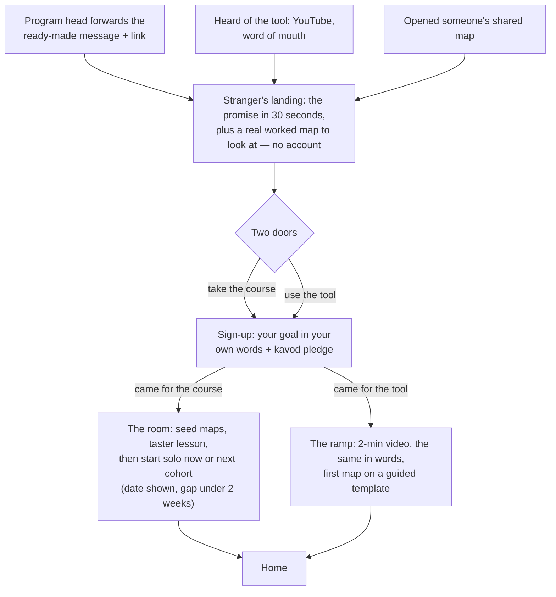
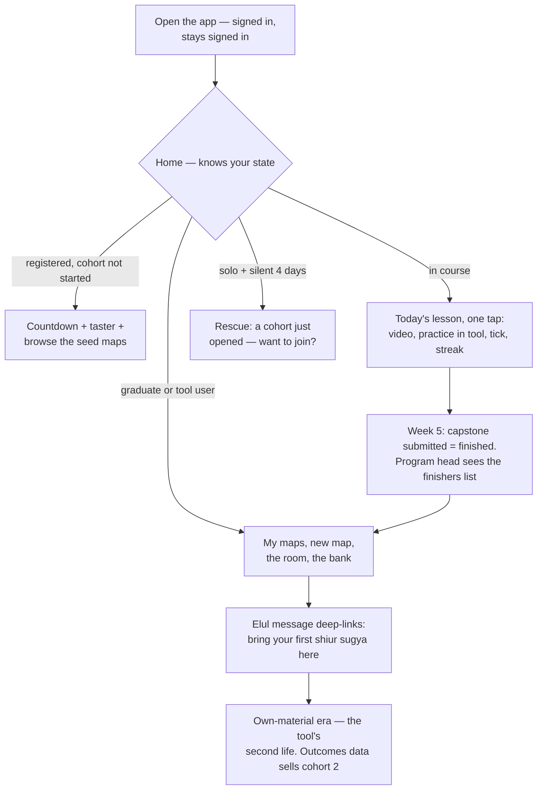

# User Flow — how it all ties together

*Captured 2026-08-04 from the user-journey conversation; structure approved by Avigail.
Slots into [`PRODUCT-MAP.md`](PRODUCT-MAP.md): it designs the stages the map flagged as
undesigned (4 and 10) and settles the spirit of open decisions D3, D4 and D6.*

## The model in one paragraph

The product is **one open beit midrash**: the pool of shared case maps plus the Analytic
tool. The **course is the guided corner inside it** — not a gate in front of it. The
cohort's WhatsApp group is the table you sit at. Admission is never gated on the course:
a day-one student browses the same room a graduate lives in. Graduation removes the
scaffolding — you were already in the room. This is what makes it one product instead of
three: course = acquire the skill, tool = use the skill, community = the skill witnessed.
The continuous object all three act on is **the student's growing collection of maps** —
the course fills it, the tool grows it, the community sees it. There are **two ways into
the room** — enroll in the course, or walk straight up to the tool — and both end in the
same pool.

## Two flows, not one

A first visit is an acquisition problem: a stranger decides to join. Every visit after
is the product: a signed-in person picks up where they left off. **The promise page
belongs only to the first flow.** It is content for strangers — never a step, never a
blocker, never seen again after sign-up. Sign-in is available from every page, and every
deep link (a shared map, a lesson nudge, the Elul message) lands inside the app, not on
marketing.

### First visit — a stranger decides

Both doors go through the same sign-up — one identity, one threshold. Returning users
never pass here again.

### Every visit after — the product

Home is the product's center: the journey is a loop around it, not a pipe through it.
The most-traveled path in the whole product is *open app → today's lesson* — it must be
one tap.

The nervous, motivated student (the real persona: accepted, wants an edge, afraid of
walking in behind) is answered at every step with the same message: *look what you can
already do.* Streaks and badges are not motivation here — they are evidence of readiness.

### The forwardable message (stage 1)

The pitch happens in the program head's WhatsApp message, *before* any page of ours
loads — the student trusts the rebbi's words, not our landing page. So we write those
words: a ready-made forwardable message, roughly two sentences plus the link, that David
hands each program head to send as-is. Example shape: *"Most guys arrive in Elul unable
to take apart a Gemara on their own. This free 5-week summer course from David Suna
fixes that before you land — start here: [link]."* Deliverable: one paragraph of copy,
not a feature. Program-head links deep-link straight to the course door.

### The second door: tool-first

Not everyone comes to enroll. The post-yeshiva university student
([`VISION.md`](VISION.md)'s secondary audience), a rebbi, someone who opened a shared
map — they want to work a sugya *now*, not join a cohort. Their journey is
course-optional by design:

- **Same door, sign-in included.** The tool door signs in like the course door — one
  identity, one threshold (goal + pledge), and a returning tool user lands on *their*
  maps. What stays free of any account: *looking* — the stranger's landing shows a real
  worked map, so nobody commits blind.
- **The ramp, not a manual.** The tool assumes the method (case, din, the 8 questions) —
  a blank tool is meaningless to a walk-in. Ramp: a 2-minute what-a-case-map-is video,
  a plain page saying the same thing in words (skimmers, filtered devices), then a first
  map on a guided template. The same ramp doubles as the graduates' Elul refresher.
- **A standing, non-pushy upgrade path:** "want this taught properly? Free 5-week course
  — next cohort [date]" lives permanently in the tool area.
- **Every shared map is a landing page.** Public maps carry a footer — *made with the
  Analytic method → learn it* — making the pool the organic funnel alongside program
  heads.

## Sharing rules

| What | Visibility | Why |
|---|---|---|
| David's worked deck examples (taught in videos) | **Open — the seed corpus** | Already solved on screen; they make the room non-empty for cohort 1 |
| Course practice exercises | **Hidden, forever** | Later cohorts do the same exercises — anti-cheat is permanent, not per-cohort |
| Capstone | **Sealed** | It is the pilot's assessment instrument |
| Post-course work (bank cases, own material) | **Shared by choice** | This is the bank: it grows; course examples stay static |

The rule in one line: **anything the video already solves is open; anything the student
must solve stays hidden.** Answer-talk during the course lives in the cohort's WhatsApp —
ephemeral and invisible to later cohorts, so it never breaks the anti-cheat rule.

## Decisions settled 2026-08-04

- **Room open to all from day one.** No graduation gate; graduation = scaffolding ends.
- **Landing has two doors** — *take the course* / *use the tool*. Program-head links
  deep-link to the course door; organic arrivals (YouTube, shared maps, word of mouth)
  choose. Both doors pass the same sign-up: goal in your own words + kavod pledge.
- **The promise blocks nothing and repeats never.** It is stranger content on the
  first-visit landing only; signed-in users open straight to Home, and deep links land
  inside the app.
- **Home is state-aware:** waiting → countdown + taster; in course → today's lesson in
  one tap; drifting solo → rescue; graduate or tool user → my maps + the room.
- **The ramp** (tool intro / how-to): 2-min video + the same content in plain words +
  guided first map. One asset, two uses — walk-in orientation and graduates' Elul
  refresher.
- **One pool** of shared maps across programs and years; **per-cohort community = the
  WhatsApp group** (settles the direction of PRODUCT-MAP D6). In-app course discussion is
  phase 2.
- **The door:** landing shows the promise first (unauthenticated, 30 seconds); joining =
  sign-in + short questionnaire — the student's goal in their own words plus a
  kavod/behavior pledge. The pledge is the pilot's moderation strategy (settles D3's
  spirit: promise before commitment, taster inside the room).
- **Intent echoed back:** the silent-week nudge and the graduation message quote the
  student's own questionnaire answer.
- **Solo start allowed** alongside cohort waves (supersedes D4's framing). Drop-off
  rescue reuses the silent-by-day-4 detector: "a cohort just opened — join?"
- **Finished = capstone submitted.** The finishers list and the assessment dataset are
  the same set.
- **The program head sees only who finished** — nothing mid-course. The student is told
  this: private struggle, witnessed finish.
- **Educator loop:** spring — the two-sentence script we write for them; cohort end —
  the finishers list; Elul — David's three structured questions. Those answers are the
  outcomes data nobody else in this field has, and they sell cohort 2.
- **Metrics:** week-1 activity → completion (= capstone) → post-course maps shared. The
  Elul message is the switch point from course metrics to room metrics.
- **Phase 2:** "see who did it, consult them"; in-app course discussion area.

## What remains — content-shaped, not structure-shaped

- [ ] The forwardable message for program heads (pitch wording in progress)
- [ ] The ramp assets: 2-min video, the same-in-words page, the guided template case
- [ ] Capstone sugya + rubric (with David)
- [ ] The seed set: which taught deck examples get published as open maps
- [ ] Questionnaire wording: the goal question + the kavod pledge
- [ ] Bank pick UX: preselected vs random (small, deferred)
